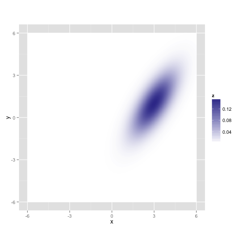
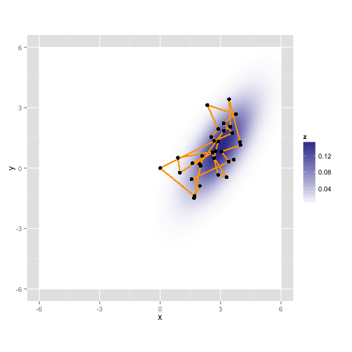
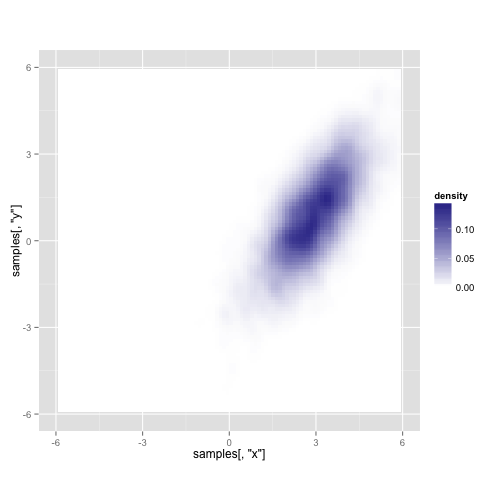

# Monte Carlo methods in statistics and Markov chain Monte Carlo

Dave Harris
Davis R Users Group, 2013-3-13

## The goal: Learn about a probability distribution

Probability distributions are super-useful because they can define a range of possibilities we expect to observe if our models are true (if you're a frequentist) or the range of plausible values for our parameters (if you're a Bayesian).

Some probability distributions, like the Normal distribution and the Poisson distribution, are relatively straightforward to work with mathematically and we have lots of handy tools for working with them by hand and on the computer.

Other probability distributions--such as distributions over parameters in a complicated model--are harder to work with.  Then we need more general tools. **Monte Carlo methods work by taking samples from a distribution that's hard to study analytically, and then studying the samples instead.**


### Example:

Here's an ugly probability distribution.  Note that, in addition to being wiggly, we don't actually know how to scale the y-axis so that the distribution sums to 1.
  
 


Even if you knew the equation that generated that thing, and you remembered everything you learned in calculus and statistics, you probably couldn't find its mean or its quantiles very easily.  But if you had 10,000 samples from the distribution, you could estimate the distribution's mean instantly by taking the sample mean.  

## Simple Monte Carlo: Rejection sampling


```r
N = 1e+07
ceiling = max(f(xs) + 1)

# Step 1: Throw N darts (uniformly distributed x-y pairs) at the plot
# above.
test.xs = runif(N, min = min(xs), max = max(xs))
test.ys = runif(N, min = 0, max = ceiling)


# Step 2: Throw away any samples that hit white areas (above the curve)
accepted.samples = test.xs[test.ys < f(test.xs)]

# Step 3: Study the samples however you want
hist(accepted.samples, breaks = 150, xlim = range(xs), freq = FALSE)
```

 

```r

mean(accepted.samples)
```

```
## [1] 1.055
```

```r

quantile(accepted.samples, probs = seq(0, 1, length = 25))
```

```
##       0%   4.167%   8.333%    12.5%   16.67%   20.83%      25%   29.17% 
## -3.76101 -0.63020 -0.32693 -0.05038  0.12511  0.26349  0.41607  0.57226 
##   33.33%    37.5%   41.67%   45.83%      50%   54.17%   58.33%    62.5% 
##  0.69066  0.78801  0.88096  0.98307  1.10093  1.21447  1.31154  1.39900 
##   66.67%   70.83%      75%   79.17%   83.33%    87.5%   91.67%   95.83% 
##  1.48678  1.58418  1.70213  1.83408  1.96193  2.09328  2.27571  2.61357 
##     100% 
##  5.78968
```


Intuitively, it should be clear that this works: wherever the curve is tallest, there's a higher probability that the darts will be retained.

That worked pretty well, but it was kind of inefficient--we ended up throwing away more than 90% of our sampling effort because the darts sailed right over the probability distribution.

Of course, this is a toy example.  It turns out that you may end up throwing away exponentially more attempts per successful sample as the number of dimensions in your data goes up.  So hardly anyone uses rejection sampling anymore--that's where the Markov chains come in.

## Markov chain Monte Carlo

Most of our discarded samples came from the tails of the distribution, where the acceptance probability is basically zero.  We could increase the number of samples we keep by spending more time in the middle of the distribution, where the acceptance probabilities are much higher.

But if all we did was concentrate our dart-throwing efforts there, then we'd end up with heavily biased samples--we don't find *any* probability mass in areas where we don't look.  Also, even if we could correct for that, we won't always know where to concentrate our efforts.  So we'll usually need something more automatic.

That's where the Markov chains come in.  MCMC has exactly the same goal as our rejection sampler, but it has more sophisticated ways of deciding where to sample.  That way, we can get a decent number of samples in a reasonable amount of time.  The downside is that the samples are correlated, so you might need a lot more of them before you've explored the whole distribution.  And you usually won't know when it's "done"--the theorems usually just say it'll work if you run the process for an infinitely long time.

Let's see what happens if we try this out on a simpler distribution in 2D.


```r
library(MASS)
library(ggplot2)
lik = function(x, y) {
    dnorm(x - 3) * dnorm(y - x + 2)
}

grid = expand.grid(x = xs, y = xs)
z = lik(grid$x, grid$y)

gaussian.plot = ggplot(data = grid, aes(x = x, y = y)) + geom_raster(aes(fill = z)) + 
    scale_fill_gradient2() + coord_equal()

gaussian.plot
```

 


Let's take a random walk along X and Y, collecting samples in proportion to their probability.  This is just like the rejection sampler, but we'll tend to throw our darts in the neighborhood of our last accepted proposal, and the acceptance rule is a bit more complicated.

Here's a sampler called the "Metropolis" algorithm, although Wikipedia claims Metropolis wasn't really involved.


```r
maxit = 50

samples = matrix(NA, nrow = maxit, ncol = 2, dimnames = list(NULL, c("x", "y")))
samples[1, ] = c(0, 0)  # start at 0,0

for (i in 2:maxit) {
    
    # propose a new sample point
    proposal = samples[i - 1, ] + rnorm(2, mean = 0, sd = 1)
    
    # Compare its likelihood with the current position
    old.lik = lik(samples[i - 1, "x"], samples[i - 1, "y"])
    new.lik = lik(proposal["x"], proposal["y"])
    
    ratio = new.lik/old.lik
    
    # flip a coin and accept the new proposal with probability min(ratio, 1)
    if (rbinom(1, size = 1, prob = min(ratio, 1))) {
        samples[i, ] = proposal
    } else {
        samples[i, ] = samples[i - 1, ]
    }
    
}


gaussian.plot + geom_path(mapping = aes(x = samples[, "x"], y = samples[, "y"]), 
    color = "orange") + geom_point(mapping = aes(x = samples[, "x"], y = samples[, 
    "y"]))
```

 


Here it is again with a different random walk using the same process

 


Here's what you get after running it for 10,000 iterations (about a second on my laptop)

 

